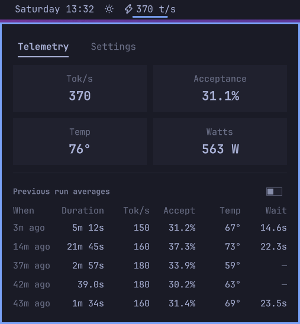
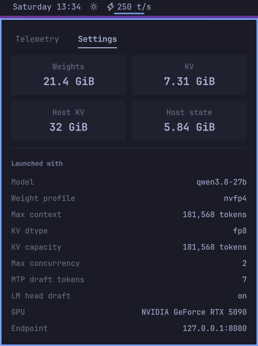

# NInfer Gauge

An [Omarchy](https://github.com/omacom/omarchy) bar widget that gauges a local [NInfer](https://github.com/Neroued/ninfer) server — a from-scratch C++/CUDA inference engine for Qwen checkpoints on a single RTX 5090.



- **The bar** — state word, decode tok/s and queue depth at a glance.
- **The popout** — live tiles, the last five runs, the committed budget and launch arguments.
- **Passive** — everything is derived from the server's systemd user journal, `GET /health` and `nvidia-smi`; the server is never modified.
- **Zero footprint** — no daemon, no extra unit; one stdlib-only python3 script per refresh.

## The bar

- `⚡ idle` — healthy, no work in flight.
- `⚡ 190 t/s` — decoding: count-derived tok/s over the last 5 s. Rates ≥ 50 round to ten; the last digit is jitter.
- `⚡ prefill` — work in flight with no decode tokens in the window yet.
- `⚡ 190 t/s · ⚠ 2` — decoding with requests waiting. The `⚠` mark and the waiting count ride beside the rate — `⚡ prefill · ⚠ 2` when the interval is prefill-only.
- `⚡ starting` / `⚡ stopping` — dimmed through the boot and shutdown.
- `⚡ down` — the unit is inactive/failed **and** `/health` is not answering.
- `✕ ninfer` (dim) — the widget is blind: no state file, or one that has stopped being updated (the collector is not running).

The urgent tint is orthogonal to the wording. It fires on `down`, when the unit is up but `/health` has stopped answering, and when the speculative accept rate has sat under 25 % for five requests (`showAccept` disables it).

## What it watches

A python3 collector (stdlib only) runs once per refresh, spawned by the plugin. No daemon, no extra unit. Each run reads the journal from where it left off, samples whichever sources are due, merges over the previous state, writes a state file atomically, and exits. The QML timer fires at 1 Hz; the collector decides what is actually due:

- journal — every tick, `journalctl --user -u ninfer -o json --after-cursor`
- health — every 2 s, `GET /health` on the port the journal says the server is listening on; any HTTP response means alive
- gpu — every 3 s, `nvidia-smi` (temp, watts, util; plus the compute apps every 15 s for VRAM attribution)

The state file is the whole contract between collector and display. It lives at `$XDG_STATE_HOME/omarchy/ninfer/stats.json` (default `~/.local/state/omarchy/ninfer/stats.json`). A lock file guards it: the journal read is consuming, and the bar can run one widget per monitor.

**Rates are count-derived.** The token counts in the journal's throughput lines are bucketed into 5 s wall-clock slots and divided by wall time.

## Runs

**A run is idle to idle, and idle means *stayed* settled.** It opens when work shows up. It settles once the verdict has stayed settled for the settle grace — 60 s by default. The collector's `--settle-ms` overrides it; 0 closes on the same tick. Sub-minute pauses between prompts stay inside one run, so a run can go for many minutes. `starting`, `stopping` and `down` settle a run on the spot.

**A run ends at the first settled tick.** Duration, temp and the When column end where the work did.

**The verdict is the gauge plus the journal.** A started request without its terminal line keeps the run busy.

**The last five settled runs form the ring the Telemetry tab reads.** Columns: when, duration, and per run tok/s, acceptance, GPU temp and queue wait — each avg and max. The wait avg is the mean of the requests that crossed the 100 ms noise floor; the max is the longest.

**A merged run reads the session's numbers, not the burst's.** Its duration spans the session, its tok/s Max the busiest coarsened window, its temp the session's average.

## The popout

Two tabs, ~380 px. **Telemetry** is the default; both tabs reset on open. `Tab` flips tabs, `r` refreshes, `Esc` closes.

**Telemetry.** Four live tiles in two columns of two. tok/s and acceptance are the current run's numbers; idle, they read as dashes. GPU temp and watts stay real while idle. Colour sits on the value, not the tile. Temp goes red at 87 °C — three degrees under the 90 °C spec limit of current NVIDIA cards, tuned on an RTX 5090 — in the bar's urgent colour. When the server is down, the banner `⚠ Can't reach ninfer at <endpoint>` replaces the grid. The runs table below stays.

**Previous runs.** One row per settled run, most recent first, up to five. Columns: When · Duration · Tok/s · Accept · Temp · Wait. An Avg/Max toggle switches every stat column; Duration does not switch — it is the run's own span. Temp is red at 87 °C like the live tile. Wait toggles like the rest and is a muted dash when the run's requests never sat in the queue.

**Settings.** The committed budget on top — **Weights**, **KV**, **Host KV**, **Host state** — in the engine's own journal vocabulary. It comes from the `weights ready`, `capacity` and `host … pinned` boot lines. Below it, the engine's arguments in launch order under a **Launched with** header: model, weight profile, max context, KV dtype, KV capacity, max concurrency, draft tokens, LM-head draft, GPU, endpoint. Read-only. The tiles hold what the last boot committed — the same whether the server is up or down. A fresh cursor or a purged journal reads as dashes until the boot lines have been seen.



## Scope

- One box, one server — the gauge watches a single `ninfer` unit.
- History is the five-run ring — settled runs live in the state file, capped at five, with no longer storage.
- The journal line format is the contract — the collector parses NInfer's journal lines, so a change in NInfer's logging is a change to the gauge.
- A view, not a control — everything it touches is read-only, and there is no path from the widget to the server.

## Requirements

- Linux with systemd (the plugin reads the **user** journal)
- a NInfer server running as a systemd user unit, named `ninfer` by default — or any unit whose journal lines it can parse; see the collector's `--unit` flag. On Arch Linux the [`ninfer-git` AUR package](https://aur.archlinux.org/packages/ninfer-git/) builds the engine from the upstream repository — `omarchy pkg aur add ninfer-git` installs it, or pick it in the AUR install menu (`omarchy pkg aur install`).
- `nvidia-smi` (an NVIDIA GPU)
- `python3` (stdlib only)
- [Omarchy](https://github.com/omacom/omarchy)

## Installation

Clone (or copy) the repository to a **real directory** at `~/.config/omarchy/plugins/michaeldewildt.ninfer-gauge/`. Not a symlink: the shell's inotify watcher does not follow symlinks. The shell reloads plugins on its own (~150 ms), so there is nothing to restart.

```
git clone https://github.com/michaeldewildt/ninfer-gauge ~/.config/omarchy/plugins/michaeldewildt.ninfer-gauge
```

The plugin activates on demand; its widget appears in the bar's widget picker as **NInfer Gauge** (aliases `ninfer-gauge`, `ninfer`). With a running server it reads `⚡ idle`.

## Removal

One command; the bar entry goes with the plugin:

```
omarchy plugin remove michaeldewildt.ninfer-gauge --yes
```

## Widget settings

From the shell, distinct from the popout's **Settings** tab (which shows the server's boot parameters and is read-only):

```
omarchy bar set michaeldewildt.ninfer-gauge <key> <value>
```

- `refreshMs` (default 1000, 500–10000) — how often the collector runs; the collector gates its own slower sources.
- `gpuIndex` (default 0) — which card `nvidia-smi` reads.
- `showGpu` (default true) — `false` skips `nvidia-smi` entirely on the collector.
- `showAccept` (default true) — the speculative-accept bar alarm (urgent tint).
- `statePath` — read this state file instead of running the collector.

The collector itself takes a few more flags (`--unit`, `--health-url`, `--gpu-index`, `--no-gpu`, `--settle-ms`) when you run it directly. The widget wires up two of them — `gpuIndex` and `showGpu`.

## Development

- **`Main.qml`** — data only: the refresh timer and a FileView on the state file.
- **`Panel.qml`** — display only: the bar button and the two-tab popout, with no I/O nodes of its own.
- **`collect/omarchy-ninfer-stats-update`** — the collector: journal parsing, state derivation, the runs ring, the state file.
- **`util/format.js`** — every number the widget prints, so the bar and the popup agree.
- **`tests/`** — fixture-driven tests (below).

Testing:

```
python3 tests/test_parsers.py     # line shapes + state derivation + the golden
node    tests/test_format.mjs     # bar strings and popup formatting
python3 tests/make_fixtures.py    # re-freeze the golden after a contract change
```

- `tests/fixtures/sample.txt` is a real journal dump (~1 h of server traffic). Every request line in it must parse. An absent field becomes `null` (or `0` for `queue`), never a parse failure.
- `tests/fixtures/stats-golden.json` is that journal replayed at a pinned clock. The test diffs against it, so any change to what the widget can read shows up as a reviewable diff.
- `tests/fixtures/states/` is one state file per display state (12 of them, including `temp-danger`, which drives the tile threshold colour). Point the widget at one to drive the display without a server:

  ```
  omarchy bar set michaeldewildt.ninfer-gauge statePath \
      ~/.config/omarchy/plugins/michaeldewildt.ninfer-gauge/tests/fixtures/states/queued.json
  ```

  and back to live data with `omarchy bar set michaeldewildt.ninfer-gauge statePath ""`.

The collector against the live journal, writing nothing:

```
journalctl --user -u ninfer -o json -n 500 | \
    collect/omarchy-ninfer-stats-update --stdin --dry-run
```

Widget observability from the shell:

```
omarchy-shell michaeldewildt.ninfer-gauge probe
→ b1|bar=⚡︎ 190 t/s|state=busy|urgent=false|dim=false|stale=false|decode=193.4|gpu=42|reqs=1162|age=…ms|cfg=refresh:1000,gpu:0,showGpu:1,showAccept:1|tab=telemetry|mode=avg|content=353px|scroll=no|open=true
```

- `content` is the height of the content being shown. A Column ignores invisible children, so it is exactly what is in front of the user. `scroll` reports whether it exceeds the flick — the no-scroll acceptance test. Both report `-` while the popup is closed.
- `cfg=` is the effective widget settings — the `omarchy bar set` surface — plus `fixture:1` while fixture mode is active.
- `buildTag` (the `b1` prefix) discriminates the running component build — bump it with every `Panel.qml` change. The reload path can serve the previously compiled QML, so if an edit appears not to take effect, check the tag first. `omarchy restart shell` gets a fresh process.

## License

MIT — see [LICENSE](LICENSE).
